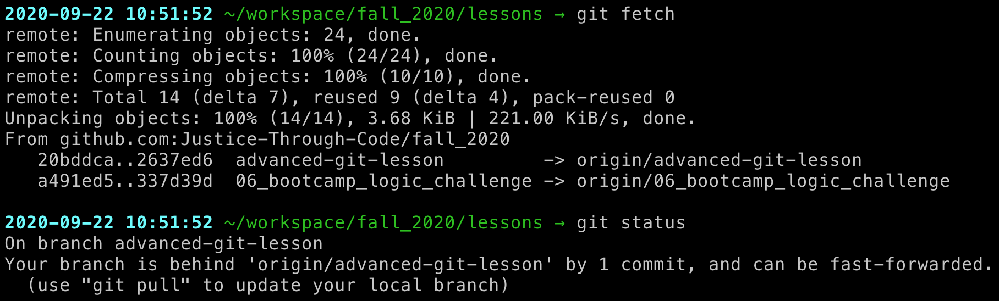
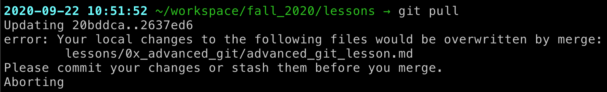
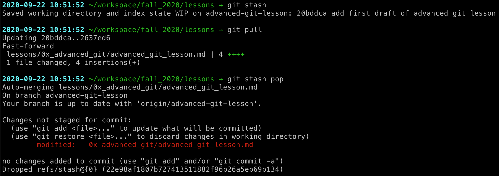

# Advanced Git & Github: Merge Conflicts


# Outline of class agenda
1. Learn about what merge conflicts are
2. Get some practice with dealing with merge conflicts
3. Plan ahead to avoid merge conflicts in your workflows


## 1. The dreaded merge conflicts

### *What is a marge conflict?*

When commits have been made **to the same file** on different branches at the same time.

It might look something like this on your command line:

```console
CONFLICT (content): Merge conflict in README.md
Automatic merge failed; fix conflicts and then commit the result.
```


### *Why do merge conflicts happen?*


If you create a pull request and see that the branches can't be automatically merged, or that there are conflicts, this means that commits were made to _at least 1 file in common_ across the branches


### *Forgetting to pull first!*

This is one of the biggest sourcess of merge conflicts! It is pretty much *always* a good idea to **pull from your repo before you start working**, especially when collaborating!

## 2. Dealing with merge conflicts

So, we've talked about what merge conflicts are, but that doesn't help us deal with them. Let's address that now.

Want a more detailed walkthrough for how to resolve merge conflicts? Check out this page from the [Github Documentation](https://docs.github.com/en/github/collaborating-with-issues-and-pull-requests/resolving-a-merge-conflict-using-the-command-line#:~:text=Merge%20conflicts%20occur%20when%20competing,see%20%22About%20merge%20conflicts.%22)

### Resolving merge conflicts: what does this mean?

After a merge conflict has occured, we have to *resolve it.* This means:

* Opening up any files with conflicts (i.e. that were edited on multiple branches simultaneously)
* Identify which changes you want to keep from each commit
* Fix the file and delete all the conflict markers (`<<<<<<<`, `=======`, `>>>>>>>`)
* Add & commit the changes you've made to the conflicted file
* Push changes

From the [Github Docs](https://docs.github.com/en/github/collaborating-with-issues-and-pull-requests/resolving-a-merge-conflict-using-the-command-line#:~:text=Merge%20conflicts%20occur%20when%20competing,see%20%22About%20merge%20conflicts.%22)

*To see the beginning of the merge conflict in your file, search the file for the conflict marker <<<<<<<. When you open the file in your text editor, you'll see the changes from the HEAD or base branch after the line <<<<<<< HEAD. Next, you'll see =======, which divides your changes from the changes in the other branch, followed by >>>>>>> BRANCH-NAME. In this example, one person wrote "open an issue" in the base or HEAD branch and another person wrote "ask your question in IRC" in the compare branch or branch-a.*

### Vscode has a *fancy* tool for this

Vscode helps us do this, because it automatically highlights conflicts and gives us options for resolution. We'll practice this in the demo and challenge today, but for more info, [check out here](https://code.visualstudio.com/docs/editor/versioncontrol)


## 3. Avoiding merge conflicts


### Run `git pull` or `git fetch` before you work!

Now, every time we sit down in our computer to code we will first check to see if anyone else has made changes in the meantime using `git fetch`.

In order to check whether there are changes on the remote version of the code, we then need to use `git status` to show us a comparison between our version of the world and what exists on the remote.

Typically, you will either already be in sync with the remote branch or you will need to "pull" the changes.

Here is an example of what your system might look like after fetching:


It looks like there are no new changes that you need to integrate with your local copy of the code so there is no need to perform a `git pull` at this time.

Here is another possibility of how your system might appear after fetching:



In this case, the changes made to the local version and the one from GitHub were done in separate sections of the code so it's easy to simply `git pull` those changes to your local copy of the repository.

Pulling the changes means that you are accepting the current state of the code at the remote location.

```console
$ git pull
```

Sometimes, you will try to pull the code but will get an error message that you have local changes that you need to commit first so they don't get trampled on when you pull in your collaborator's changes.



In this case, you can either do a `git commit` if you are ready to accept this bite of work you've done or you can temporarily `git stash` your changes so that they are protected when you pull in the new code and then `git pop stash` and continue where you left off.



However, sometimes you and your collaborator will step on each others' toes and will edit the same part of the code at the same time. Then, when you do your `git fetch`, you might instead see a message like this:


This is a merge conflict. We will talk about how to deal with these in the challenge.

Remember that Git is always keeping track of changes to files so pulling might overwrite your work if you and your collaborator were editing the same part of the code, but you can always recover your work. In the challenge, we will talk about how to handle these kinds of conflicts.
